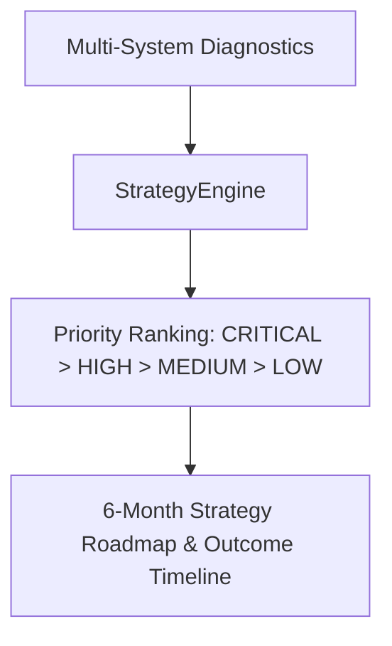

# HydroGrow AI Autonomous Strategy Engine

Architecture for long-term farm strategy generation, priority ranking, and post-execution impact verification.

---

## 1. Strategy Generation & Priority Matrix

