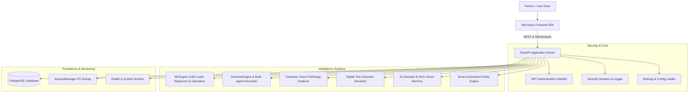

# HydroGrow AI System Architecture Overview

HydroGrow AI is an enterprise autonomous smart farming platform engineered across 12 modular phases.

---

## High-Level Architecture Diagram

---

## Subsystem Matrix

| Subsystem | Components | Primary Responsibilities |
| :--- | :--- | :--- |
| **Growth Prediction** | `prediction.py`, `growth_model.py` | Biomass weight prediction (g), validation clipping, and R² metrics |
| **IoT Telemetry** | `sensor_manager.py`, `/ws/iot/live` | Live sensor data ingestion, boundary validation, WebSocket streaming |
| **Automation Engine** | `crop_lifecycle_manager.py`, `action_simulator.py` | Actuator simulation (fans, nutrient pumps, pH dosing, chillers) |
| **Computer Vision** | `image_processor.py`, `disease_detector.py` | Leaf pathology diagnosis (Tip Burn, Root Rot, Chlorosis) |
| **Digital Twin** | `growth_simulator.py`, `scenario_engine.py` | 35-day virtual crop growth simulation & override comparisons |
| **Autonomous Copilot**| `decision_engine.py`, 5 AI Sub-Agents | Multi-agent context harvester, deduplication, priority ranking |
| **Machine Learning** | `ml_engine.py`, `train_pipeline.py` | RandomForest models, model version control, zero-crash fallback |
| **Production Core** | `backup_manager.py`, `security.py` | Database backups, security headers, container health checks |
