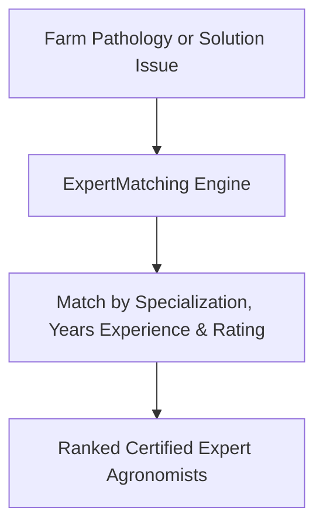

# HydroGrow AI Expert Agronomist Network

Architecture for expert profile verification, matching algorithm, and consultation request dispatching.

---

## 1. Expert Matching Algorithm

```mermaid
graph TD
    GrowerQuery[Farm Pathology or Solution Issue] --> Matcher[ExpertMatching Engine]
    Matcher --> Criteria[Match by Specialization, Years Experience & Rating]
    Criteria --> Output[Ranked Certified Expert Agronomists]
```
