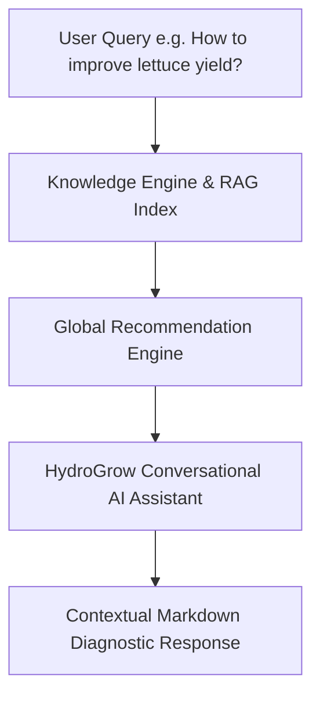

# HydroGrow AI Knowledge Intelligence & RAG Pipeline

Pipeline architecture integrating agronomic research, knowledge search, recommendation synthesis, and conversational AI.

---

## 1. Intelligence Pipeline Flow

