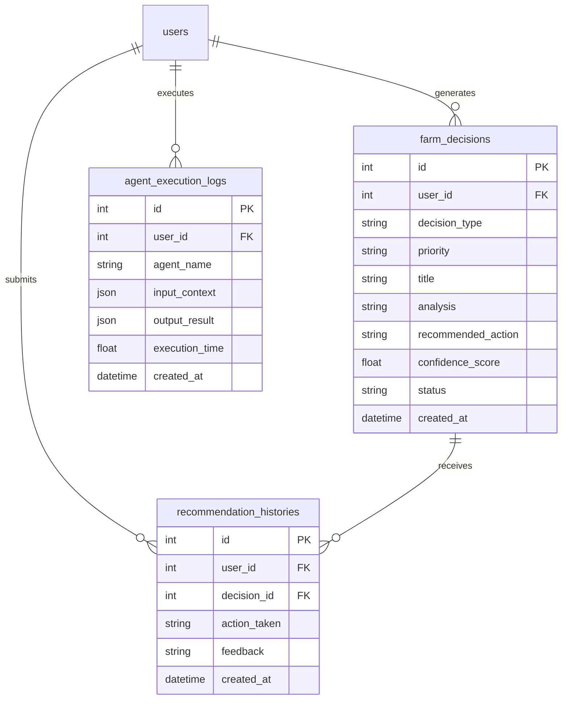

# Phase 10 Technical Report: Autonomous Farm Copilot & Multi-Agent Decision Intelligence System

This document provides technical documentation for Phase 10 of HydroGrow AI — transforming the platform into an **Autonomous AI Farm Manager**.

---

## 1. Multi-Agent Architecture & Decision Workflow

The system coordinates five specialized autonomous AI sub-agents to continuously analyze complete farm conditions, rank agronomic decisions, execute simulated automation actions, and learn from farmer feedback.

```mermaid
graph TD
    Telemetry[IoT Sensors & Devices] --> Harvester[DecisionEngine Context Harvester]
    Vision[Computer Vision Scans] --> Harvester
    Twin[Digital Twin Forecasts] --> Harvester
    Analytics[Analytics Performance] --> Harvester
    
    Harvester --> CA[CropAgent]
    Harvester --> ClA[ClimateAgent]
    Harvester --> DA[DiseaseAgent]
    Harvester --> NA[NutritionAgent]

    CA --> Ranker[Priority Ranker & Deduplicator]
    ClA --> Ranker
    DA --> Ranker
    NA --> Ranker
    
    Ranker --> OA[OptimizationAgent]
    OA --> DB[(PostgreSQL farm_decisions)]
    DB --> Route[/api/copilot/analyze]
    Route --> WS[/ws/iot/live ai_recommendation]
    Route --> UI[React Copilot Dashboard /copilot]
```

---

## 2. Agent Responsibilities & Decision Rules

1. **`CropAgent`**: Monitors growth lifecycle progress, heights, and biomass rates. Detects slow growth bottlenecks and suggests light and solution adjustments.
2. **`ClimateAgent`**: Evaluates IoT readings for heat stress (>28°C), humidity anomalies (>80%), CO2 deficits (<350 ppm), and water temperature spikes (>25°C).
3. **`DiseaseAgent`**: Converts vision leaf pathology reports into disease risk scores (Tip Burn, Pythium Root Rot, Nutrient Deficiency, Leaf Spot, Fungal Stress).
4. **`NutritionAgent`**: Analyzes pH drift (acidic/alkaline) and EC levels (depletion/salt buildup) to formulate dosing corrections.
5. **`OptimizationAgent`**: Aggregates multi-agent outputs to synthesize yield efficiency and energy cost reduction strategies.

---

## 3. Database Schema Extensions

Three new PostgreSQL tables:



---

## 4. API Endpoints

- `GET /api/copilot/analyze`: Evaluates farm telemetry across all agents, computes composite farm health index (0-100), saves decision logs, and streams live WebSocket notifications over `/ws/iot/live`.
- `GET /api/copilot/decisions`: Returns historic AI decision logs.
- `POST /api/copilot/execute/{decision_id}`: Triggers simulated action relays via `ActionSimulator`.
- `POST /api/copilot/feedback`: Stores farmer feedback (`Helpful`, `Not Helpful`, `Completed`, `Ignored`).

---

## 5. Verification & Testing Results

- **Backend Unit Tests:** **120 tests executed, 120 passed (OK)**.
- **Frontend Production Build:** Compiled cleanly via Vite in **13.66 seconds with 0 errors**.
- **Schema Migration:** Autogenerated Alembic migration `c0ed9d7f8a38_add_autonomous_ai_decision_tables` with rollback validation tested.
