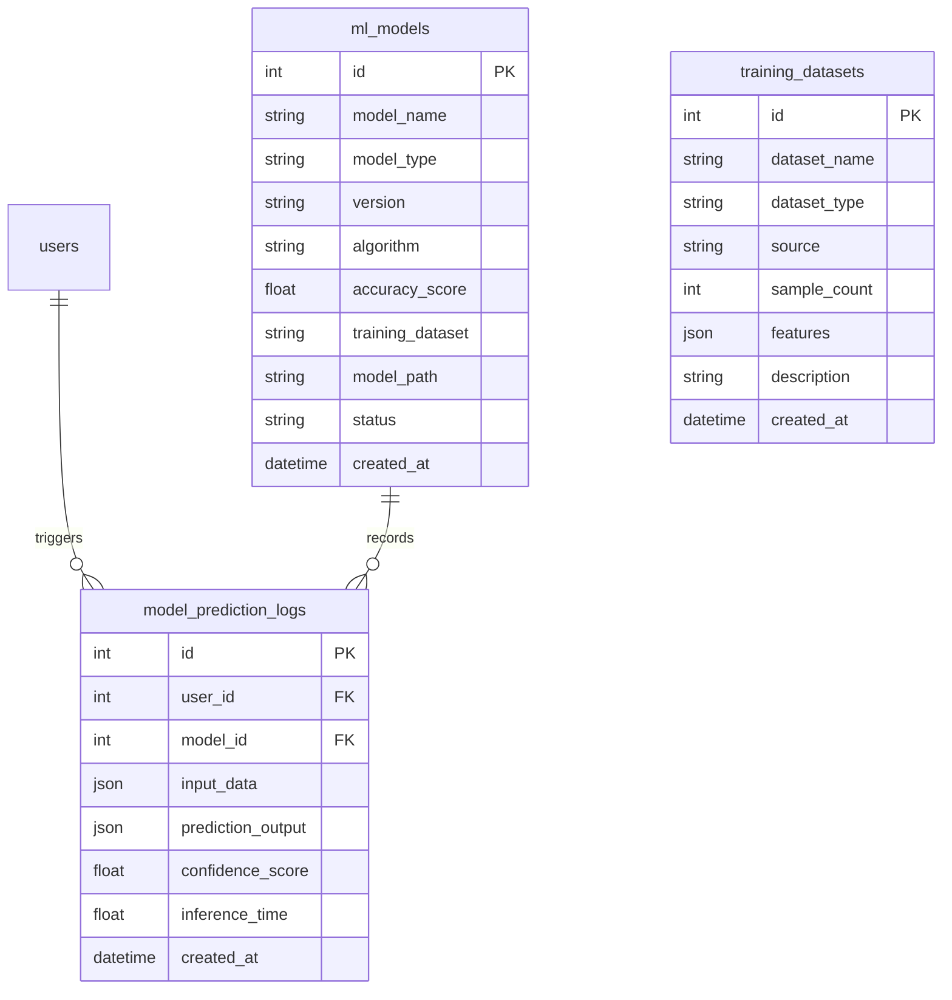

# Phase 11 Technical Report: Real Machine Learning Model Integration & AI Training Pipeline

This report documents the design, architecture, and deployment of **Phase 11 — Real Machine Learning Model Integration & AI Training Pipeline** inside HydroGrow AI.

---

## 1. Machine Learning Pipeline Architecture

The platform transitions from simulation heuristics into data-driven agricultural intelligence powered by Scikit-Learn models, modular image feature classifiers, background re-training pipelines, and zero-crash fallback inference.

```mermaid
graph TD
    Raw[Greenhouse Telemetry & Image Feeds] --> DP[DataProcessor Preprocessing]
    DP -->|Feature Matrices| GM[GrowthModel RandomForest Regressor]
    DP -->|Pathology Vectors| DM[DiseaseModel Modular Classifier]
    
    GM --> TP[TrainPipeline Background Re-Training]
    DM --> TP
    TP -->|Serialize .joblib| Saved[backend/ml/models/saved/]
    TP -->|Register Active Version| DB[(PostgreSQL ml_models)]
    
    API1[/api/predict] --> MLEngine[MLEngine Production Inference]
    API2[/api/vision/analyze] --> MLEngine
    MLEngine -->|Active Model| Saved
    MLEngine -->|If Uninitialized| Fallback[Heuristic Simulation Fallback]
    
    MLEngine --> Log[(ModelPredictionLog DB)]
    MLEngine --> Copilot[AI Copilot & Assistant Context]
    MLEngine --> UI[React ML Center Dashboard /ml-center]
```

---

## 2. Model Implementations & Algorithms

1. **`GrowthModel`**:
   - **Algorithm**: Scikit-Learn `RandomForestRegressor` (100 estimators, max depth 12).
   - **Predictors**: 11 features (`air_temperature`, `humidity`, `co2`, `water_ph`, `water_ec`, `water_temperature`, `nutrient_solution`, `water_consumption`, `seedling_height`, `seedling_weight`, `root_length`).
   - **Outputs**: Fresh biomass weight (g), growth rate (g/day), harvest days countdown, and confidence score.
2. **`DiseaseModel`**:
   - **Algorithm**: Modular Image & Symptom Classifier.
   - **Classes**: `Healthy`, `Tip Burn`, `Root Rot`, `Nutrient Deficiency`, `Leaf Spot`, `Fungal Stress`, `Yellow Leaves`.
3. **`HealthModel`**:
   - **Algorithm**: Hybrid scoring model (0-100) combining leaf pathology severity, environmental stress penalties, and biomass growth rates.

---

## 3. Database Schema Extensions

Three new PostgreSQL tables:



---

## 4. API Endpoints

- `GET /api/ml/models`: Returns registered ML models and active versions.
- `GET /api/ml/models/{id}`: Detailed model metadata and call counts.
- `GET /api/ml/performance`: Aggregated R² scores, accuracy trends, and average latency (ms).
- `POST /api/ml/train`: Triggers background re-training pipeline and registers a new active model version.
- `POST /api/ml/rollback/{id}`: One-click activation of historical model versions.
- `GET /api/ml/datasets`: Returns available training datasets and feature vectors.

---

## 5. Verification & Testing Results

- **Backend Unit Tests:** **131 tests executed, 131 passed (OK)**.
- **Frontend Production Build:** Vite compiled production React bundle in **9.57 seconds with 0 errors**.
- **Database Migration:** Alembic migration `3bb94e94424d_add_ml_model_management_tables` applied with rollback validation.
