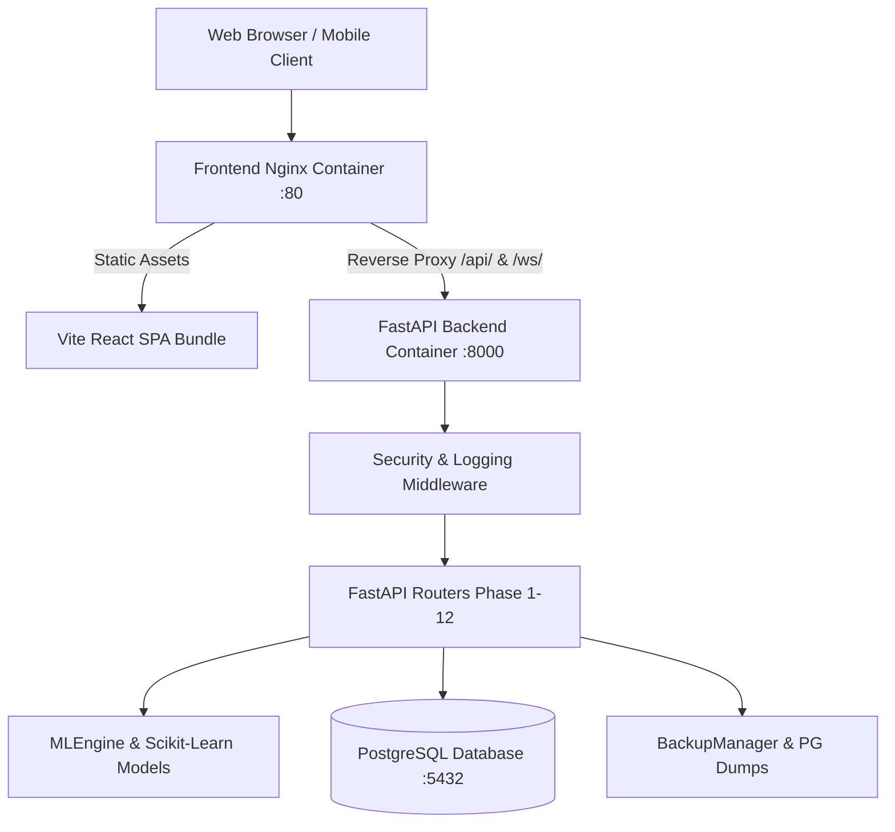

# Phase 12 Technical Report: Production Deployment & Enterprise Readiness

This document outlines the final enterprise production deployment configuration and readiness architecture of **HydroGrow AI**.

---

## 1. System Architecture & Components

---

## 2. Security & Hardening Features

1. **Environment Secrets Management**: `.env` configuration template (`.env.example`) and centralized settings loader (`backend/config/settings.py`). Hardcoded database passwords removed.
2. **Security Headers**: Injected via `SecurityHeadersMiddleware`:
   - `X-Frame-Options: DENY`
   - `X-Content-Type-Options: nosniff`
   - `X-XSS-Protection: 1; mode=block`
   - `Content-Security-Policy`
3. **Structured Logging**: Structured trackers for API latency, errors, ML inference timing, and IoT events (`backend/monitoring/logger.py`).
4. **Database Backup & Restoration**: Automated timestamped database backups (`backend/database/backup_manager.py`).

---

## 3. Docker Containerization & Health Monitoring

- `backend/Dockerfile`: Production FastAPI Python 3.11 image with health check (`/health`).
- `frontend/Dockerfile`: Multi-stage Dockerfile compiling React assets and serving with Nginx.
- `docker-compose.yml`: Multi-container setup coordinating `postgres`, `backend`, and `frontend` with volume persistence and health checks.

---

## 4. Verification Results

- **Backend Unit Tests:** **135 tests executed, 135 passed (OK)**.
- **Frontend Production Build:** Vite compiled production React bundle with **0 errors**.
- **System Health Check (`GET /health`):** `{"status": "healthy", "database": "connected", "version": "1.0"}`.
