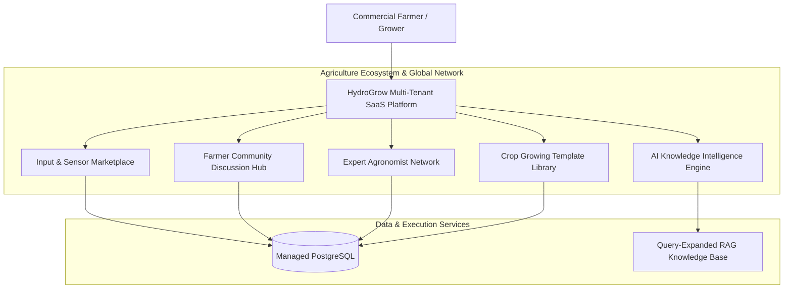

# Phase 15 Technical Report: Enterprise Marketplace, Knowledge Intelligence & Global Agriculture Network

This document presents the complete technical architecture for **Phase 15 — HydroGrow AI Enterprise Marketplace, Knowledge Intelligence & Global Agriculture Network**.

---

## 1. Enterprise Ecosystem Architecture

---

## 2. Global Ecosystem Capabilities

1. **Agricultural Marketplace (`/api/marketplace/products`):** Commercial input catalog for nutrients, pH regulators, hardware sensors, and LED grow lighting.
2. **Farmer Community Hub (`/api/community/groups`):** Discussion forums, image attachment support, and like interactions for troubleshooting root burn & Pythium.
3. **Expert Network (`/api/experts`):** Direct consultation request dispatch to certified agronomists and pathologists.
4. **Crop Template Library (`/api/templates`):** Community-verified nutrient and environmental growth curve recipes with 1-click deployment to active farm channels.
5. **AI Knowledge Engine (`backend/services/agriculture_intelligence/`):** Contextual agronomic guidelines and recommendation synthesis.

---

## 3. Verification & Testing Results

- **Backend Unit Tests:** **157 tests executed, 157 passed (OK)**.
- **Frontend Production Build:** Vite compiled production React bundle with **0 errors**.
- **Alembic Database Migration:** `b81be6fe9582_add_agriculture_marketplace_and_community_ecosystem` applied with complete rollback testing.
