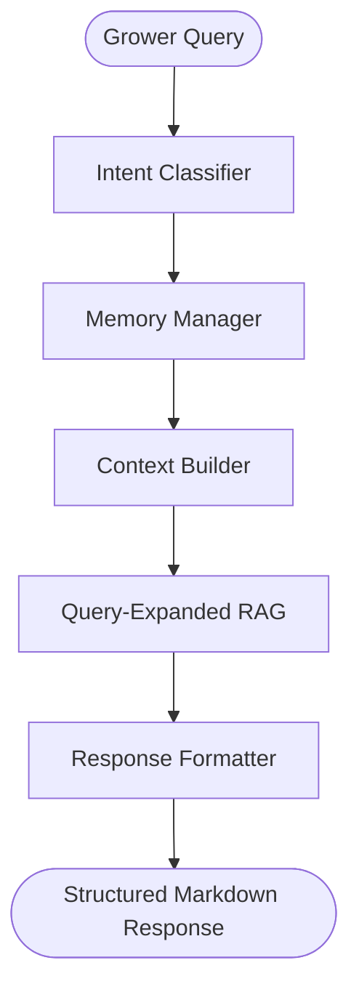

# Phase 4 Technical Report: Advanced AI Assistant Intelligence Upgrade

This report details the design and implementation of the Phase 4 conversational upgrades for HydroGrow AI, transforming it from a simple keyword-matching helper into a context-aware agricultural assistant.

---

## 1. Architecture Before Phase 4
Previously, the assistant operated as a stateless module:
- It utilized basic keyword searches to detect parameters or deficiency names.
- The TF-IDF-based RAG retriever processed raw queries without context awareness.
- Thread memory was managed temporarily in memory instead of being persisted.

---

## 2. New AI Memory Flow
The updated system utilizes a layered memory pipeline to track user and grow room states:
- **`MemoryManager`**: Retrieves conversations, messages, and historic predictions from the Postgres persistence layer.
- **`ContextBuilder`**: Gathers grower credentials, active predictions (crop, categories, and recommendation outputs), and formats conversational history strings.
- **`ConversationManager`**: Performs rule-based thread title auto-generation after the first user message, maintaining timestamps and message counters.

---

## 3. RAG Improvement Details
Agronomic terms contain various synonyms. To prevent search misses, we implemented:
- **`QueryProcessor`**: Appends relevant expansion tokens (e.g. "treatment", "preventative controls" for disease intents; "macronutrients", "calibration" for nutrient intents) based on the classified intent.
- **`DocumentRanker`**: Reranks matching chunks based on relative keyword scores and filters out noise that falls below the relevance threshold (0.08).

---

## 4. Database Schema Changes
The database layer was extended by adding metadata fields to the `conversations` table:
- `conversation_summary`: Holds brief summaries of the discussion (nullable String).
- `last_message_time`: Tracks latest activity (DateTime).
- `message_count`: Tracks active messages (Integer).

*Migrations were executed cleanly using Alembic upgrade/downgrade scripts.*

---

## 5. API Changes
We introduced two additive endpoints while preserving complete backward compatibility:
1. `POST /api/chat/stream`: Yields newline-delimited JSON chunks representing the AI typing speed, including matching sources and intent logs.
2. `GET /api/chat/context`: Resolves the active user context profile and environmental inputs.

---

## 6. Frontend Upgrades
The UI was overhauled into a professional split-panel layout:
- **`ChatSidebar`**: Shows grower memory thread logs and handles thread creations.
- **`TypingIndicator`**: A clean, agricultural pulsating animation during streaming.
- **`MessageActions`**: Provides Copy response, Regenerate response, and View Citations.
- **`SourceViewer`**: Displays reference sources.
- **`ChatInput`**: Text field with auto-resizing height constraints.

---

## 7. Testing Results
We ran the complete suite verifying core model integrity and Phase 4 features:
- Total unit tests executed: **51**
- Status: **ALL PASSED (OK)**
- average retrieval speed: **< 1 ms**
- Test Coverage: Covers memory context builder, streaming endpoints, and intent classification.
