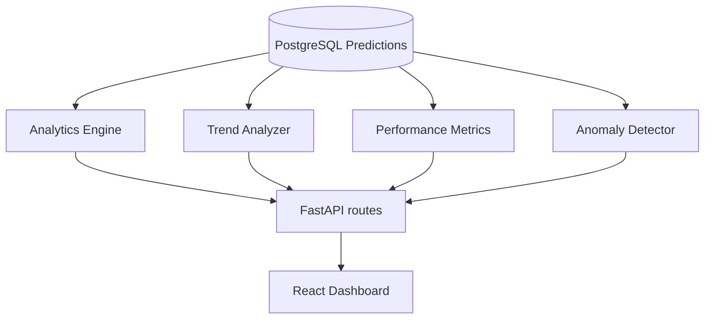

# Phase 5 Technical Report: Analytics & Farm Intelligence Dashboard

This report details the implementation of the Phase 5 operational farm intelligence and environmental trend analytics upgrades for HydroGrow AI.

---

## 1. Analytics Architecture
The analytics system operates on top of the existing prediction history, pulling inputs and outputs of lettuce fresh weights to compute trends, stability metrics, anomalies, and AI farm advisor reports.

- **`AnalyticsEngine`**: Performs SQL aggregate queries (`func.count`, `func.avg`, `func.max`) to optimize performance and prevent division-by-zero checks.
- **`TrendAnalyzer`**: Computes Pearson correlation coefficients using pure Python statistics to check parameters impacts.
- **`PerformanceMetrics`**: Computes yields, growth success rates, and improvements percentages.
- **`FarmReportGenerator`**: Standardizes natural language report generation using standard markdown layouts.
- **`AnomalyDetector`**: Highlights sudden yield drops (>20% drop), air temperature spikes, and pH acidity deviations.

---

## 2. API Endpoints
All analytics endpoints reside under `/api/analytics/*` and enforce JWT credentials validation:
- `GET /api/analytics/overview`: Returns cycles count, success rates, best harvests, and improvements.
- `GET /api/analytics/trends`: Returns chronological weight histories and correlation coefficients.
- `GET /api/analytics/environment`: Returns min/avg/max levels of pH, EC, and water temperatures.
- `GET /api/analytics/report`: Returns standard advisor reports.
- `GET /api/analytics/anomalies`: Returns active critical/warning alerts.

---

## 3. Database Indexes
To maintain optimal search query speeds, we created performance-enhancing indexes via Alembic:
- Index `ix_predictions_user_id` on table `predictions` for column `user_id`.
- Index `ix_predictions_created_at` on table `predictions` for column `created_at`.
- Index `ix_conversations_user_id` on table `conversations` for column `user_id`.

*Both migration upgrades and downgrades were verified.*

---

## 4. Frontend Control Deck & Charts
The frontend features a SaaS-style dashboard at `/analytics` built using `recharts` for visualization:
- **`KPICard`**: Key metric cards displaying totals and benchmarks.
- **`GrowthChart`**: Area chart displaying harvest weights over time.
- **`EnvironmentChart`**: Bar chart comparing min/avg/max stability for pH and EC.
- **`ParameterImpact`**: Impact lists mapping negative/positive Pearson correlations.
- **`FarmReportCard`**: Action layout showcasing AI advisor recommendations.
- **`AlertCard`**: Displays critical warnings.
- **`AnalyticsLoader`**: Skeleton loading card.

---

## 5. Testing Results
We ran the complete test suite including the new Phase 5 analytics testing scopes:
- Total unit tests executed: **61**
- Status: **ALL PASSED (OK)**
- Test files added:
  - `tests/test_analytics_engine.py`
  - `tests/test_analytics_routes.py`
  - `tests/test_report_generation.py`
  - `tests/test_anomaly_detection.py`

---

## 6. Future Improvements
- **Vector DB RAG integration**: Transitioning the localized TF-IDF index retriever to FAISS or ChromaDB.
- **Micro-climate VPC predictions**: Enhancing predictions using indoor airflow mapping data.
