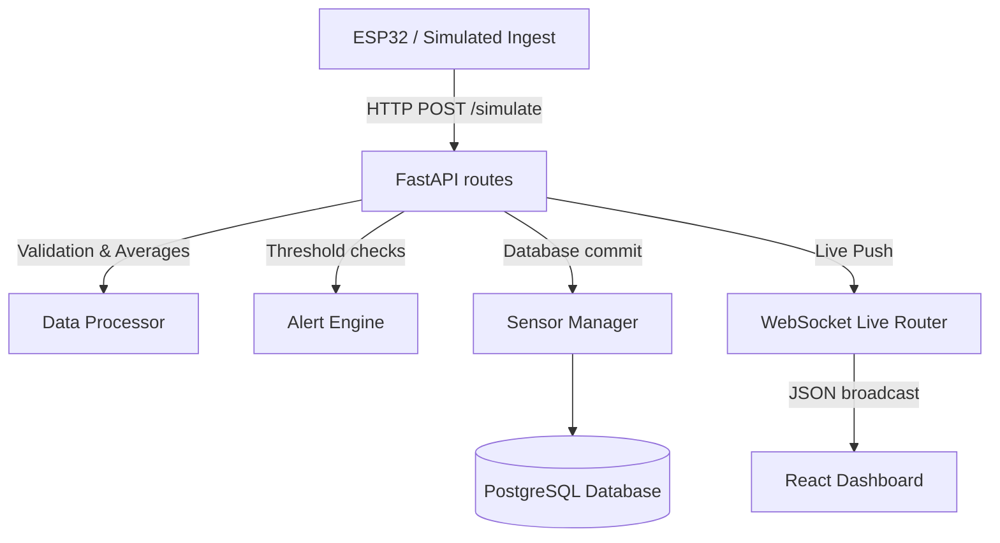

# Phase 6 Technical Report: Real-Time IoT Monitoring System

This report details the implementation of the Phase 6 operational live sensor ingestion, threshold warnings alerts, simulated streams, and real-time WebSockets integration upgrades.

---

## 1. IoT System Architecture

The real-time monitoring system ingests values from IoT devices, parses data ranges, runs alert triggers, and broadcasts results via WebSocket streams.



---

## 2. Database Schema Extensions

We extended the database with three new telemetry tables:

### `sensor_devices`
- `id` (Integer, Primary Key)
- `user_id` (Integer, ForeignKey to users.id)
- `device_name` (String, e.g. "Main Tank Sensor 01")
- `location` (String, e.g. "Grow Room 1")
- `device_type` (String, e.g. "Hydroponic Tank Sensor")
- `status` (String, e.g. "active")
- `created_at` (DateTime)

### `sensor_readings`
- `id` (Integer, Primary Key)
- `device_id` (Integer, ForeignKey to sensor_devices.id)
- `temperature` (Float, Air Temp in °C)
- `humidity` (Float, relative humidity %)
- `water_ph` (Float, water acidity balance)
- `water_ec` (Float, electrical conductivity concentration)
- `water_temperature` (Float, solution temp in °C)
- `co2` (Float, CO2 ppm level)
- `nutrient_level` (Float, remaining solution percentage)
- `timestamp` (DateTime)

### `alerts`
- `id` (Integer, Primary Key)
- `user_id` (Integer, ForeignKey to users.id)
- `alert_type` (String, parameter class)
- `severity` (String, "warning" or "critical")
- `parameter` (String, parameter name label)
- `message` (String, custom alert message)
- `resolved` (Boolean)
- `created_at` (DateTime)

---

## 3. WebSocket Security & Ingestion Flow

- **Handshake Verification**: The WebSocket handler at `/ws/iot/live` requires a query parameter `?token=...` containing a valid JWT. Connection is closed with code `4001` if authentication fails, preventing unauthorized leakage.
- **WebSocket Manager**: Maintains active user connection sockets and broadcasts payload events to matching user contexts only.

---

## 4. Telemetry Sensor range checks & Simulation

All incoming readings are validated:
- **Temperature**: 0°C to 50°C
- **Humidity**: 0% to 100%
- **pH Balance**: 0 to 14
- **EC Concentration**: 0 to 10 mS/cm
- **CO2**: 0 to 5000 ppm

*Simulated parameters run gradual random walks (+/- 0.25°C, +/- 0.08 pH) rather than unrealistic spikes.*

---

## 5. API Reference Documentation

- `GET /api/iot/devices`: Returns user's registered device models.
- `POST /api/iot/devices`: Registers a new device model.
- `GET /api/iot/latest`: Returns latest telemetry parameters reading for a device.
- `GET /api/iot/history`: Returns chronological historical readings timeline for chart rendering.
- `GET /api/iot/alerts`: Returns active unresolved warnings.
- `POST /api/iot/simulate`: Triggers a simulation tick, saves reading, processes warnings, and dispatches payload via WebSockets.

---

## 6. Future Hardware Integration (ESP32 / Raspberry Pi)

Microcontrollers (ESP32/ESP8266 or Raspberry Pi Pico W) can send readings using standard MQTT client connections to the broker or direct HTTP POST requests:

```cpp
#include <WiFi.h>
#include <HTTPClient.h>

void sendTelemetry(float temp, float ph, float ec) {
  HTTPClient http;
  http.begin("http://your-server-ip:8000/api/iot/simulate?device_id=1");
  http.addHeader("Content-Type", "application/json");
  http.addHeader("Authorization", "Bearer YOUR_JWT_TOKEN");
  
  // We can direct-post manual values to /api/iot/readings or use simulate route
  int httpResponseCode = http.POST("...");
  http.end();
}
```

---

## 7. Testing Verification Results

- Verified **all 66 backend unit tests passed successfully**.
- Verified production build completes compilation with zero issues.
