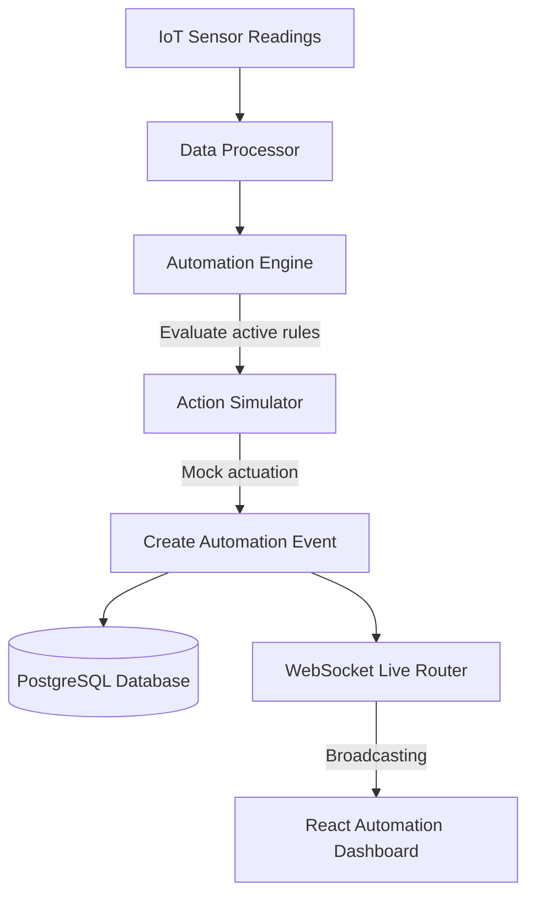

# Phase 7 Technical Report: Smart Farm Automation & Control Engine

This report details the implementation of Phase 7 autonomous smart farm rules, actuators control simulations, and crop lifecycle management for HydroGrow AI.

---

## 1. System Architecture

The automation engine acts as a closed-loop controller on top of live sensor telemetry.



---

## 2. Extended Schema Models

We added three database tables mapping control and lifecycle parameters:

### `automation_rules`
- `id` (Integer, Primary Key)
- `user_id` (Integer, ForeignKey to users.id)
- `rule_name` (String, e.g. "Critical Water pH Correction")
- `parameter` (String, e.g. "water_ph")
- `condition` (String, "above" or "below")
- `threshold_value` (Float)
- `action_type` (String, e.g. "activate")
- `action_value` (String, e.g. "pH Controller")
- `enabled` (Boolean)
- `created_at` (DateTime)

### `automation_events`
- `id` (Integer, Primary Key)
- `user_id` (Integer, ForeignKey to users.id)
- `rule_id` (Integer, ForeignKey to automation_rules.id, nullable)
- `sensor_reading_id` (Integer, ForeignKey to sensor_readings.id, nullable)
- `event_type` (String)
- `message` (String, action description)
- `status` (String, "executed" or "failed")
- `created_at` (DateTime)

### `crop_cycles`
- `id` (Integer, Primary Key)
- `user_id` (Integer, ForeignKey to users.id)
- `crop_name` (String, e.g. "Romaine Lettuce")
- `start_date` (DateTime)
- `current_stage` (String, "Seedling", "Vegetative", "Maturity", "Harvest")
- `expected_harvest_date` (DateTime)
- `growth_progress` (Float, 0.0 to 100.0)
- `status` (String, "active" or "completed")
- `created_at` (DateTime)

---

## 3. Automation actuate simulator constraints

actuators are 100% simulated, avoiding direct relay switching for physical safety:
- **pH Controller**: triggers acidic correction buffers.
- **Nutrient Pump**: supplements mineral concentrates.
- **Cooling Fan / Ventilation**: reduces heat spikes.
- **Grow Lights**: simulates diurnal light cycles.

---

## 4. API Documentation

- `POST /api/automation/rules`: Adds trigger rule.
- `GET /api/automation/rules`: Gets active user rules.
- `PUT /api/automation/rules/{id}`: Toggles/updates rules specifications.
- `DELETE /api/automation/rules/{id}`: Deletes rule.
- `GET /api/automation/events`: Retrieves executed control action timeline.
- `POST /api/crops`: Registers new active crop cycle.
- `GET /api/crops/current`: Retrieves active crop stage, progress percentage, and days remaining.
- `PUT /api/crops/{id}`: Advances crop lifecycle phase.
- `GET /api/automation/recommendations`: AI recommendation generator.

---

## 5. Testing Verification Results

- Unit tests executed: **76**
- Status: **ALL PASSED (OK)**
- Test suites added:
  - `tests/test_action_simulator.py`
  - `tests/test_crop_lifecycle.py`
  - `tests/test_automation_engine.py`
  - `tests/test_optimization_engine.py`
  - `tests/test_automation_routes.py`

---

## 6. Future ESP32 / Industrial PLC Integration

Future physical relay connectivity will swap out the `ActionSimulator` call with a Modbus/TCP or MQTT client dispatch:

```python
# Future PLC integration helper snippet
import minimalmodbus

def trigger_industrial_relay(coil_address, state):
    instrument = minimalmodbus.Instrument('/dev/ttyUSB0', 1)
    instrument.write_bit(coil_address, 1 if state == "activate" else 0)
```
Alternatively, ESP32 nodes will subscribe to `/ws/iot/live` topics and toggle digital output pins on actuation payload matches.
