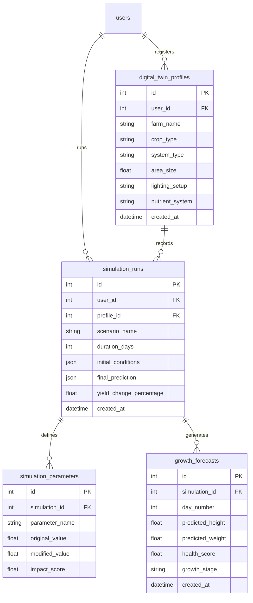

# Phase 9 Technical Report: Digital Twin & Crop Simulation Intelligence Engine

This report details the design and deployment of the Digital Twin smart farming capabilities inside HydroGrow AI.

---

## 1. Architecture Flow

The digital twin module replicates biological lettuce growth dynamically, mapping environmental settings and nutrient recipes over duration periods.

```mermaid
graph TD
    UI[React Digital Twin Deck] -->|POST Override parameters| Route[/api/twin/simulate]
    Route -->|Telemetry resolution| TE[Twin Engine]
    TE -->|Consume IoT/history| DB[(PostgreSQL DB)]
    Route -->|Daily loops| GS[Growth Simulator]
    GS -->|Incremental projections| FE[Forecast Engine]
    GS -->|Stresses & advice| SE[Scenario Engine]
    Route -->|Saves state log| DB
    Route -->|Pushes frames day-by-day| WS[ws_manager.broadcast_to_user]
    WS -->|Live updates stream| UI
```

---

## 2. Database Models & Relationships

Four tables were created:



---

## 3. Crop Simulation Flow

Projections compute daily increments across lettuce crop lifecycles:
1. **Seedling Stage** (Days 1–10)
2. **Vegetative Stage** (Days 11–25)
3. **Maturity Stage** (Days 26–35)
4. **Harvest Stage** (Days 35+)

Modifiers compute growth penalties relative to ideal lettuce standards (Temp: 22°C, EC: 2.0 mS, pH: 6.0):
- **Thermal Stresses**: High air temperature reduces biomass expansion and lowers crop turgidity indices.
- **Salt Stresses**: EC spikes risk leaf tip burn necrosis.

---

## 4. API Endpoints

- `POST /api/twin/create`: CRUD configuration profiles.
- `POST /api/twin/simulate`: Executes simulation cycles and broadcasts ticks over WebSocket.
- `GET /api/twin/forecast/{simulation_id}`: Returns daily forecast logs.
- `POST /api/twin/compare`: Evaluates override parameters relative to baseline indexes.
- `GET /api/twin/history`: Returns simulation run histories.
- `GET /api/twin/recommendations`: Provides AI recovery recommendations.

---

## 5. Verification Results

- Unit tests executed: **109**
- Status: **ALL PASSED (OK)**
- Production React compilation: **Clean build, 0 errors**
