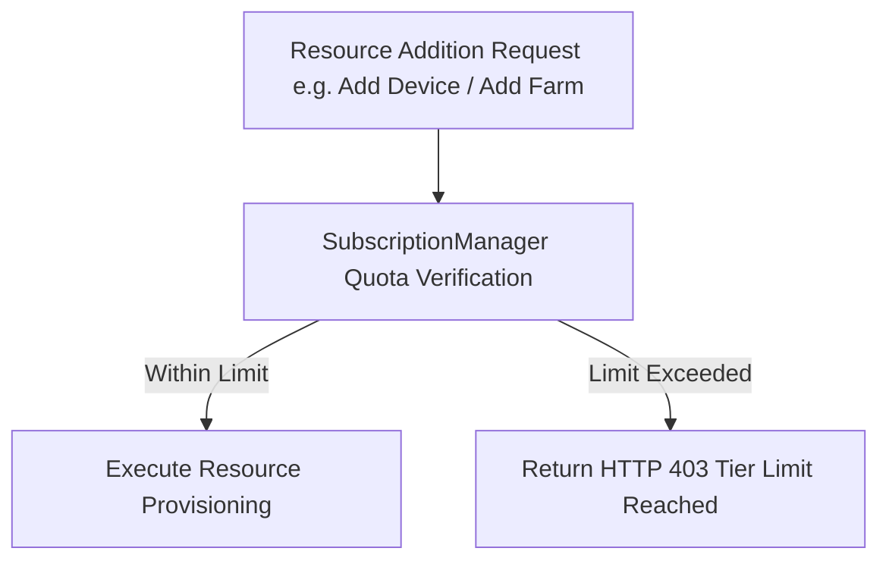

# HydroGrow AI SaaS Subscription & Quotas System

Overview of subscription plans, quota checks, and tier upgrade paths.

---

## 1. Quota Enforcement Flow

```mermaid
graph TD
    Req[Resource Addition Request e.g. Add Device / Add Farm] --> SubCheck[SubscriptionManager Quota Verification]
    SubCheck -->|Within Limit| Grant[Execute Resource Provisioning]
    SubCheck -->|Limit Exceeded| Deny[Return HTTP 403 Tier Limit Reached]
```
